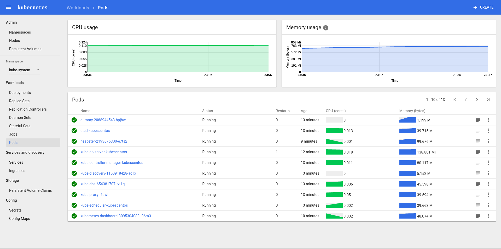

# kube-cluster-ansible

## Overview
Kubernetes v1.5.1 cluster deployment **bundle** including the following:

[heapster](https://github.com/kubernetes/heapster) [dashboard](https://github.com/kubernetes/dashboard) with basic authentication enabled, 
[influxdb](https://www.influxdata.com/) and [grafana](http://grafana.org/) for monitoring events and 
[fluentd](http://www.fluentd.org/) - [elasticsearch](https://www.elastic.co/) - [kibana](https://github.com/kubernetes/kubernetes/tree/master/cluster/addons/fluentd-elasticsearch)
for cluster log management. 

tested on CentOS 7 and Ubuntu16.04 behind http-proxy.

credits:
[Installing Kubernetes on Linux with kubeadm](http://kubernetes.io/docs/getting-started-guides/kubeadm/),
[easy-cube](https://github.com/danpilch/easy-kube),
[ansible](https://github.com/kubernetes/contrib/tree/master/ansible).

### Requrements

Ansible (tested on 2.1.2.0)

### Installation

Setup 1 vanilla machine with your chosen provider.

* Copy your public ssh key on your machine user's ~/.ssh authorized_keys folder

* If you are on CentOS is required to disable SELinux by running `setenforce 0`  You have to do this until kubelet can handle SELinux better.

* In your [inventory](./inventories/main.ini) fill the Hostname, username and the public IP address.

* Set usernames and passwords [here](./roles/master/files/passwords.csv) for kubernetes-proxy https-service authentication (future provision for internal Oauth2 provider).

* If your want to alter the default settings e.g. adding a proxy or selecting your favorite network provider: [defaults](./inventories/group_vars/all.yml)


Now you can provision your K8s cluster running on the project root:

`ansible-playbook playbooks/deploy-cluster.yml`

*For testing the solution on a local Vagrant go [here](#notes).

### Verification

* If you want to access k8s cluster securely copy the `/etc/kubernetes/kubelet.conf` file from master node to `~/.kube/config` 
on your local machine (of course you need to install `kubectl` locally), then you can access your cluster with `kubectl proxy`

To check if everything has provisioned correctly, on your master node, invoke:

`kubectl get nodes`

This will output all the nodes connected in the cluster:

```
NAME                 STATUS    AGE
centos-2gb-lon1-01   Ready     24m
centos-2gb-lon1-02   Ready     24m
centos-2gb-lon1-03   Ready     25m
```

To check the pod network is running correctly, invoke:

`kubectl get pods --all-namespaces`

You should see:

```
NAMESPACE     NAME                                       READY     STATUS    RESTARTS   AGE
kube-system   dummy-2088944543-m5vvc                     1/1       Running   0          27m
kube-system   elasticsearch-logging-v1-7xrw6             1/1       Running   0          27m
kube-system   elasticsearch-logging-v1-f4hql             1/1       Running   0          27m
kube-system   etcd-cluster.thema.io                      1/1       Running   0          27m
kube-system   fluentd-es-v1.20-jf0k8                     1/1       Running   0          27m
kube-system   heapster-2193675300-kwgpd                  1/1       Running   0          27m
kube-system   kibana-logging-3953273462-9qg8f            1/1       Running   0          27m
kube-system   kube-apiserver-cluster.thema.io            1/1       Running   1          27m
kube-system   kube-controller-manager-cluster.thema.io   1/1       Running   0          27m
kube-system   kube-discovery-1769846148-ctgz4            1/1       Running   0          27m
kube-system   kube-dns-2924299975-ww6d5                  4/4       Running   0          27m
kube-system   kube-proxy-twb20                           1/1       Running   0          27m
kube-system   kube-scheduler-cluster.thema.io            1/1       Running   0          27m
kube-system   kubernetes-dashboard-3095304083-lzr79      1/1       Running   0          27m
kube-system   monitoring-grafana-838819444-7bjxb         1/1       Running   0          27m
kube-system   monitoring-influxdb-1353739890-mhb88       1/1       Running   0          27m
kube-system   weave-net-65xpt                            2/2       Running   0          27m
```

Congratulations!!! Now you can login with your credencials in kubernetes-dashboard: [https://master_hostname:6443/ui](https://master_hostname:6443/ui)



#### NOTES: 
* Not tested using nodes (minions) yet, except master as minion. (to be continued)
* If you want to test it with vagrant just set in [inventory](./inventories/main.ini) `kubes_advertise_ip=172.28.128.159`, 
as the vagrant's **private_network IP**`` the same for the host replacing `example.host`. Finally set `ansible_ssh_user=vagrant`
Then start the virtaul box Vagrant machine and copy you public ssh key:
```
vagrant up
ssh-copy-id vagrant@172.28.128.159
```
then run:
```
ansible-playbook playbooks/deploy-cluster.yml
```
